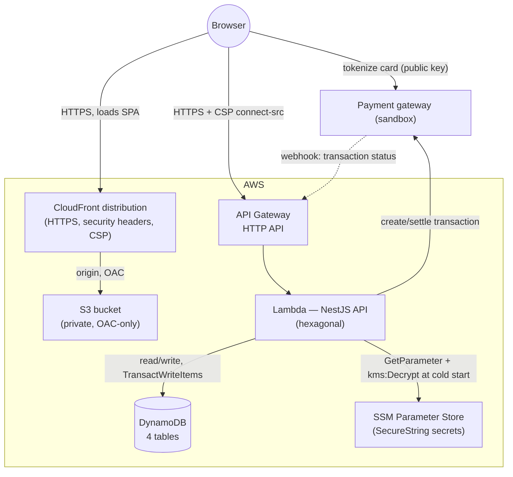
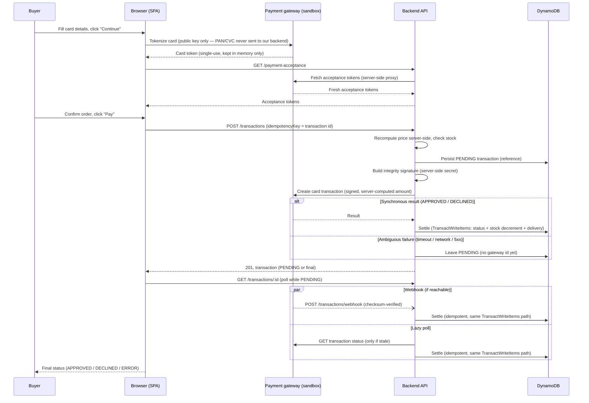
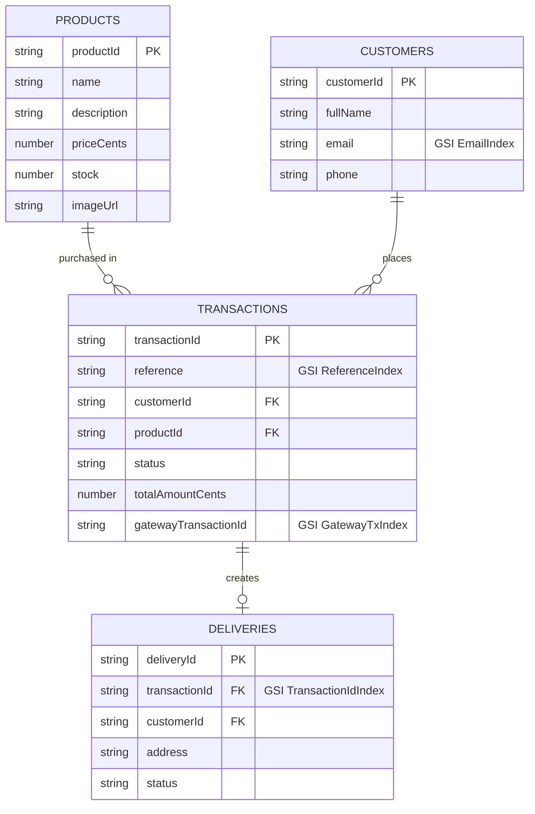

# Product Checkout App

A mobile-first single-page checkout: pick a product, pay by credit card through a payment
gateway (sandbox), and follow the payment to its final status. Five steps: **product page →
credit card & delivery info → summary → final status → product page (stock updated)**. Guest
checkout — no accounts — and the progress survives a page refresh.

Monorepo, three packages:

| Package | What it is |
|---|---|
| [`backend/`](./backend/README.md) | NestJS API — hexagonal architecture, Railway Oriented Programming |
| [`frontend/`](./frontend/README.md) | React + Redux Toolkit SPA — step machine, no router |
| [`infra/`](./infra/README.md) | AWS CDK — serverless deploy (CloudFront + S3, Lambda, DynamoDB) |

Each package README is the source of truth for its own internals; this document is the map.

## Table of contents

- [Live links](#live-links)
- [Architecture](#architecture)
- [Checkout flow](#checkout-flow)
- [Data model](#data-model)
- [API endpoints](#api-endpoints)
- [Security](#security)
- [Testing & coverage](#testing--coverage)
- [Local development](#local-development)
- [Deployment & CI/CD](#deployment--cicd)
- [Key decisions](#key-decisions)
- [Project structure](#project-structure)
- [Development process](#development-process)

## Live links

<!-- LIVE_URLS -->
| Resource | URL |
|---|---|
| Web app | TBD after first deploy (CloudFront URL) |
| API base URL | TBD after first deploy |
| Swagger UI | TBD after first deploy (`<api>/docs`) |
| OpenAPI JSON (Postman-importable) | TBD after first deploy (`<api>/docs-json`) |
<!-- /LIVE_URLS -->

<!-- TODO: link docs/screenshots/ once captured -->

## Architecture



- **Frontend** — React 18 SPA (Vite), Redux Toolkit as the Flux store, a step machine
  (`PRODUCT → DETAILS → SUMMARY → RESULT`) instead of a router, and a `localStorage`
  persistence whitelist that never persists the card token. See
  [frontend/README.md](./frontend/README.md).
- **Backend** — NestJS, Hexagonal Architecture (Ports & Adapters): each bounded context
  (`products`, `customers`, `transactions`, `deliveries`, `payment-acceptance`) has a
  `domain/` (entities, value objects, repository ports — no framework/AWS imports),
  `application/` (use cases), and `infrastructure/` (DynamoDB repositories, HTTP controllers)
  layer. Every use case returns `AppResultAsync<T>` (`neverthrow`'s `ResultAsync`) and
  propagates failures as values — controllers only call `.match(onOk, onErr)`, no
  `try/catch`, no ad hoc status codes. See [backend/README.md](./backend/README.md).
- **Infra** — AWS CDK (TypeScript), 3 stacks deployed together (`DataStack`, `WebStack`,
  `ApiStack`) plus a `GithubOidcStack` bootstrap deployed once, manually, before the others
  exist. See [infra/README.md](./infra/README.md).

## Checkout flow

The payment sequence, covering tokenization, idempotency, and the three ways a transaction
gets settled:



The sandbox is a shared account where our webhook URL can't be registered, so in practice the
lazy poll is what settles transactions; the webhook endpoint is implemented and tested for a
real merchant setup.

A retried `POST /transactions` with the same `idempotencyKey` lands on the same row and never
charges the gateway twice. All three settlement paths (synchronous result, webhook, lazy poll)
funnel through one use case, so a race between any two of them can never double-apply the
`APPROVED` side effects — enforced atomically by a single DynamoDB `TransactWriteItems` on the
transaction, product stock, and delivery. Details:
[backend/README.md § Key decisions](./backend/README.md#key-decisions).

## Data model

Four DynamoDB tables, one per aggregate:



| Table | Partition key | GSIs | Purpose |
|---|---|---|---|
| `Products` | `productId` | — | Direct get; catalog listing via `Scan` |
| `Customers` | `customerId` | `EmailIndex` (`email`) | Upsert-by-email dedupe on checkout |
| `Transactions` | `transactionId` | `ReferenceIndex` (`reference`), `GatewayTxIndex` (`gatewayTransactionId`) | Idempotency on create; webhook/poll lookup |
| `Deliveries` | `deliveryId` | `TransactionIdIndex` (`transactionId`) | Embed a delivery on `GET /transactions/:id` |

## API endpoints

Full interactive documentation (request/response schemas, examples) is at `<api>/docs`; the raw
OpenAPI document is at `<api>/docs-json` and imports directly into Postman.

| Method | Path | Purpose |
|---|---|---|
| `GET` | `/health` | Liveness probe |
| `GET` | `/products` | List every product available for checkout |
| `GET` | `/products/:id` | Product detail, including current stock |
| `GET` | `/payment-acceptance` | Server-side proxy for the gateway's acceptance tokens |
| `POST` | `/transactions` | Create a checkout transaction (server-computed price, synchronous gateway call) |
| `GET` | `/transactions/:id` | Poll a transaction; self-heals a stale `PENDING` via a lazy poll |
| `POST` | `/transactions/webhook` | Gateway webhook — checksum-verified |
| `GET` | `/customers/:id` | Customer detail (partially masked — no auth layer) |
| `GET` | `/deliveries/:id` | Delivery detail (partially masked — no auth layer) |

## Security

Guest checkout, by design — no login, no session. That only stays safe with these controls in
place (mapped loosely to OWASP concerns):

| Concern | Control |
|---|---|
| Sensitive data exposure | Card PAN/CVC never reach this backend or any storage — tokenized directly in the browser against the payment gateway; only a single-use token crosses our API |
| Secrets management | Gateway secrets live in SSM Parameter Store as `SecureString`, fetched by the Lambda at cold start — never configured as Lambda environment variables, never in source control |
| Broken access control | Least-privilege IAM: the Lambda can only read/write the 4 checkout tables (+ `TransactWriteItems`) and `ssm:GetParameters` on exactly the 3 gateway secrets, with `kms:Decrypt` limited to calls made through SSM |
| Credential exposure in CI/CD | Deploys authenticate via GitHub OIDC (`aws-actions/configure-aws-credentials`) — no long-lived AWS keys stored anywhere |
| Transport security | HTTPS everywhere: CloudFront redirects HTTP→HTTPS; the API is only ever called over HTTPS |
| Security misconfiguration | CloudFront response-headers policy (HSTS, `X-Content-Type-Options: nosniff`, `X-Frame-Options: DENY`, `Referrer-Policy: strict-origin-when-cross-origin`) and a strict Content-Security-Policy; `helmet()` on the API |
| Cross-origin abuse | CORS allowlist (`CORS_ALLOWED_ORIGINS`) — only the deployed SPA origin (and `localhost` in dev) may call the API |
| Denial of service | Per-route rate limiting (`@nestjs/throttler`); `/health` and the webhook are explicitly exempt so gateway retries and health checks are never throttled away |
| Injection / mass assignment | Global `ValidationPipe` with `whitelist` + `forbidNonWhitelisted` + `transform` — any unknown field on a request body is rejected, never silently dropped or passed through |
| PII exposure | `GET /customers/:id` and `GET /deliveries/:id` partially mask email, phone, and address — reachable without auth, so they're masked by default |
| Tampering | A server-side integrity signature (SHA-256, server-only secret) travels with every gateway charge request; the incoming webhook is checksum-verified before use |

Full rationale, including how guest checkout stays safe without an auth layer, is in
[backend/README.md § Key decisions](./backend/README.md#key-decisions).

## Testing & coverage

All three packages are developed strict-TDD (RED → GREEN → REFACTOR); CI enforces an **80%
coverage gate on every PR** (`jest.config.ts` in each package). Numbers below were measured
directly against this repository:

| Package | Statements | Branches | Functions | Lines | Suites / Tests |
|---|---|---|---|---|---|
| `backend` (unit) | 100% | 100% | 100% | 100% | 47 suites / 387 tests |
| `backend` (e2e) | — | — | — | — | 1 suite / 17 tests (DynamoDB Local) |
| `frontend` | 99.39% | 97.88% | 100% | 99.35% | 47 suites / 454 tests |
| `infra` | 100% | 100% | 100% | 100% | 6 suites / 38 tests |

- **Backend e2e** runs against a real `AppModule` and DynamoDB Local, with a deterministic
  fake gateway adapter (no network) — covers the full happy path, declined path, insufficient
  stock, validation, webhook checksum, and hardening (headers, CORS, rate limiting).
- **Frontend** gaps are documented, unreachable defensive guard clauses (e.g. a disabled
  control's own handler) — never left silently uncovered.
- **Infra** tests assert stack shape (`assertions`) against a fixture Lambda asset — no AWS
  account or credentials needed.

Run any package's suite yourself: `npm test -- --coverage` in `backend/`, `frontend/`, or
`infra/`. See each package's README for the full testing approach.

## Local development

1. **Backend** — `docker compose up -d` (DynamoDB Local), copy `.env.example` to `.env`,
   `npm install && npm run seed && npm run start:dev`. Full details:
   [backend/README.md § Running locally](./backend/README.md#running-locally).
2. **Frontend** — copy `.env.example` to `.env.local`, fill in the three `VITE_*` variables,
   `npm install && npm run dev` (`http://localhost:5173`). Full details:
   [frontend/README.md § Running locally](./frontend/README.md#running-locally).
3. **Infra** — no AWS account needed to work on it: `npm install && npm test` and
   `npx cdk synth --all` run fully offline. Deploying for real needs the one-time
   prerequisites in [infra/README.md](./infra/README.md#manual-prerequisites-one-time-per-aws-accountregion).

## Deployment & CI/CD

Branch flow: `feature/*` / `fix/*` → PR into `develop` (CI runs lint, typecheck, tests with
coverage, and an offline `cdk synth`) → PR into `main` → push to `main` triggers
`deploy.yml`, which deploys all 3 CDK stacks via GitHub Actions OIDC (no static AWS keys),
seeds the product catalog, builds and uploads the SPA, and invalidates CloudFront.

One-time setup (CDK bootstrap, the `GithubOidcStack`, SSM secrets, GitHub variables) is
documented in [infra/README.md](./infra/README.md#manual-prerequisites-one-time-per-aws-accountregion)
and only needs to run once per AWS account/region.

## Key decisions

- **Serverless (Lambda + HTTP API) over containers** — no idle cost, no cluster to manage, and
  the workload (a demo-scale checkout API) never needs to hold a persistent connection.
- **DynamoDB, one table per aggregate** — rejected a single-table design: there are no
  fan-out access patterns in scope, and a repo-per-aggregate design maps directly onto the
  hexagonal repository ports, which keeps the code reviewable.
- **AWS CDK over Terraform** — same language (TypeScript) as the backend, so stack code and
  application code share tooling, types, and CI; no separate HCL toolchain to maintain.
- **SSM Parameter Store over Secrets Manager** — both encrypt with KMS and are governed by IAM;
  Secrets Manager's real advantage is automatic rotation, which can't apply to keys issued by a
  third-party gateway. `SecureString` parameters give the same protection at no cost.
- **Idempotency key = transaction id** — a client-generated UUID v4 doubles as the DynamoDB
  partition key, so a retried request naturally lands on the same row with no separate
  idempotency table or lookup.
- **Ambiguous gateway failures stay `PENDING`, never `ERROR`** — a timeout, network error, or
  5xx means the charge may have gone through; only an explicit 4xx rejection (the gateway never
  processed the request) is definite enough to mark a transaction `ERROR`.
- **Tokenize at "Continue"**, not at final submit — the card is tokenized as soon as the payment
  form is completed, so the token (and any tokenization failure) is known before the buyer ever
  reaches the order summary.
- **Guest checkout, no auth layer** — the take-home scope is a single purchase flow, not an
  account system; the protections that make that safe (rate limiting, PII masking, strict
  input validation, price always computed server-side) are listed under
  [Security](#security).

## Project structure

```
.
├── backend/    NestJS API — hexagonal architecture (domain/application/infrastructure per module)
│   ├── src/      products, customers, transactions, deliveries, payment-acceptance, shared, health
│   └── test/     e2e suite (DynamoDB Local + fake gateway adapter)
├── frontend/   React + Redux Toolkit SPA
│   └── src/      domain (pure logic), api (HTTP clients), app (store), features, shared/ui
├── infra/      AWS CDK app
│   ├── bin/      app.ts (3 stacks) and oidc.ts (bootstrap stack, deployed separately)
│   └── lib/      DataStack, WebStack, ApiStack, GithubOidcStack
└── .github/
    └── workflows/  ci.yml (PR checks) and deploy.yml (OIDC deploy on push to main)
```

## Development process

Built with Spec-Driven Development (SDD): each change starts as a written proposal and spec
before any code, with AI assistance directing implementation rather than freehand prompting.
Strict TDD (RED → GREEN → REFACTOR) throughout, one feature branch and PR per change, and
adversarial review passes (a fresh reviewer, blind to the author's reasoning, checks the diff
before merge) ahead of every merge into `develop`.
