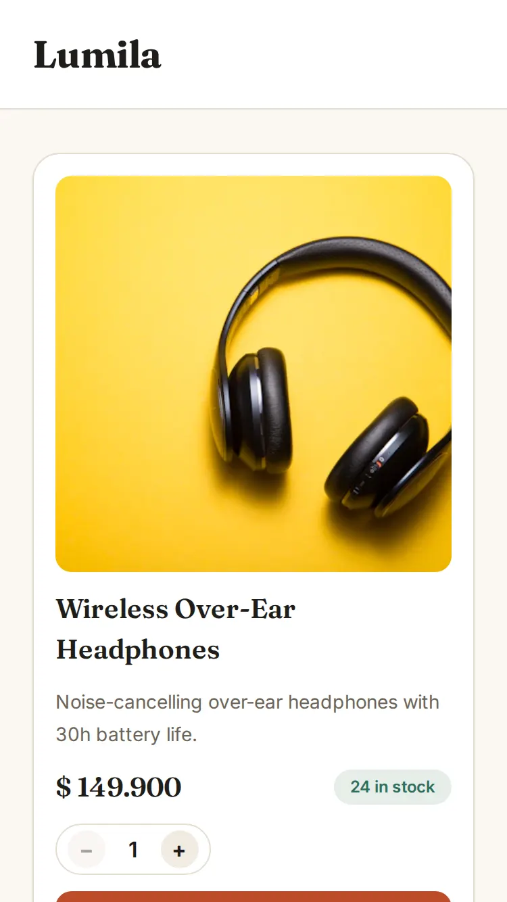
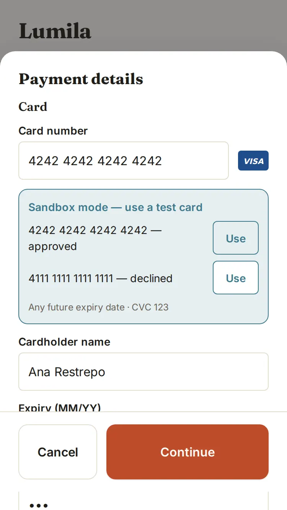
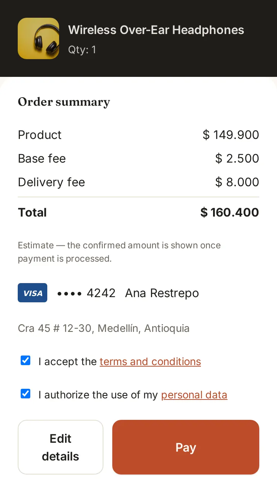
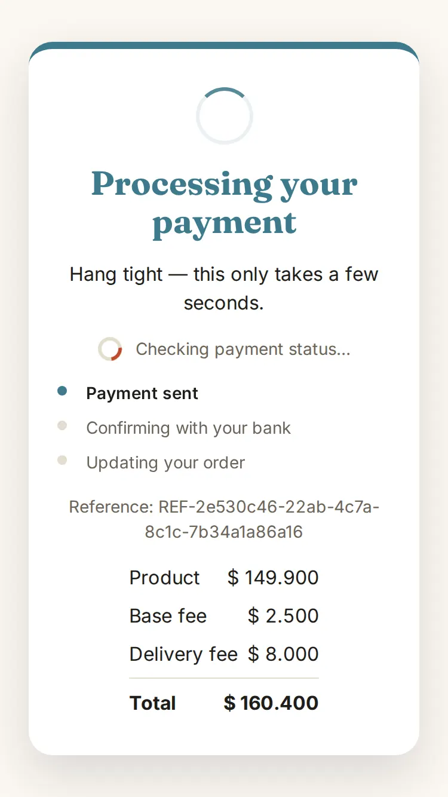
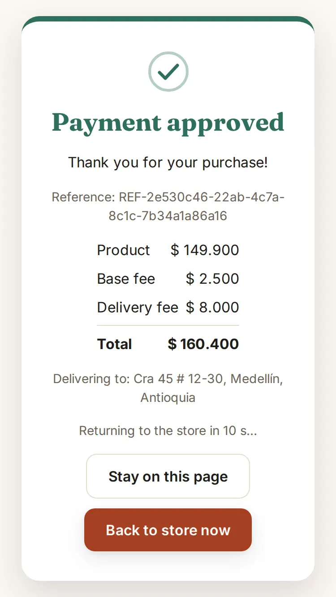
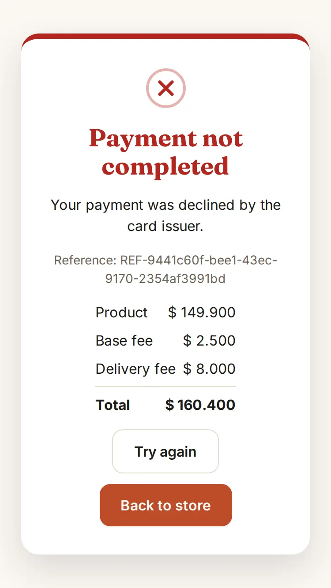
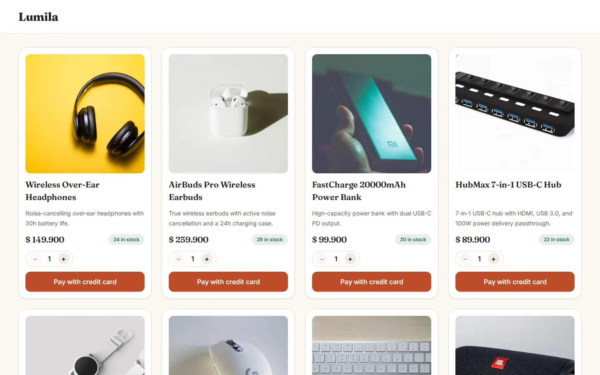
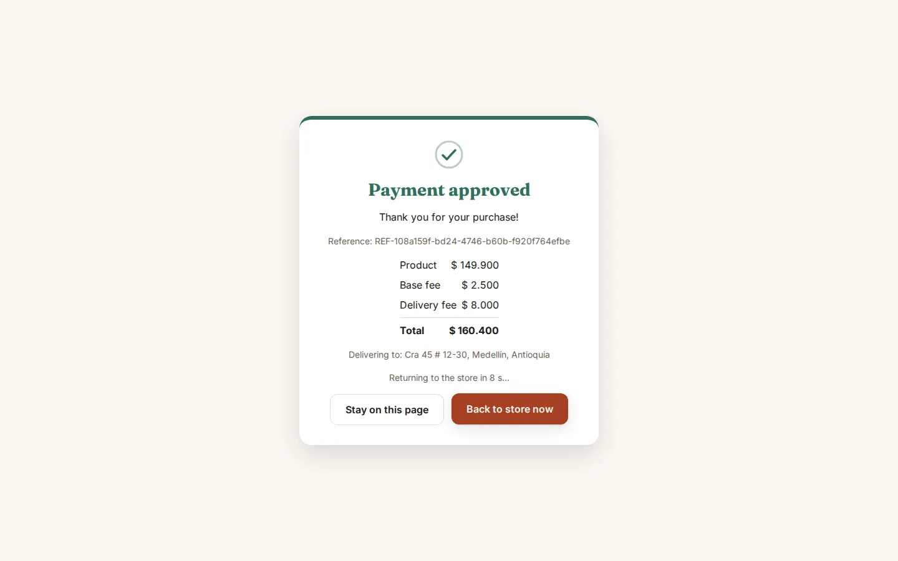
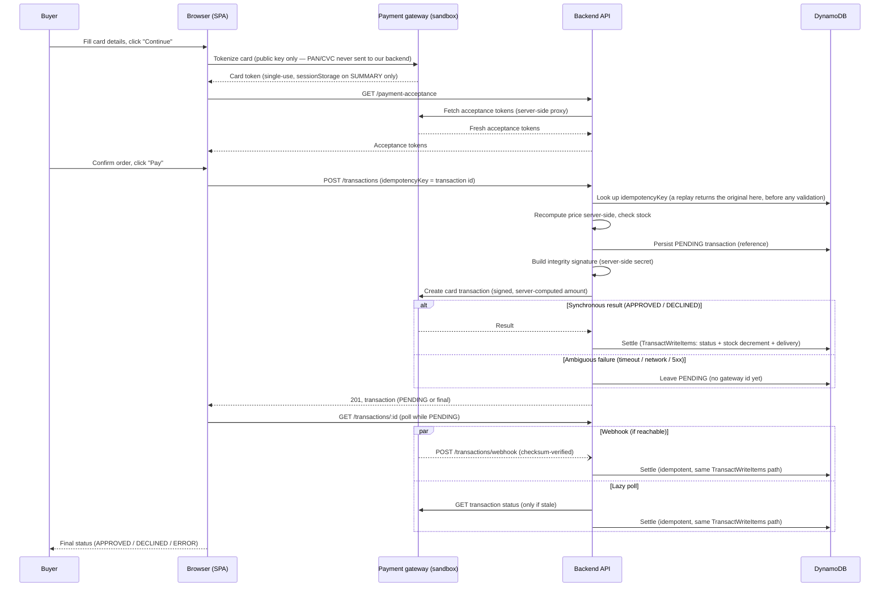
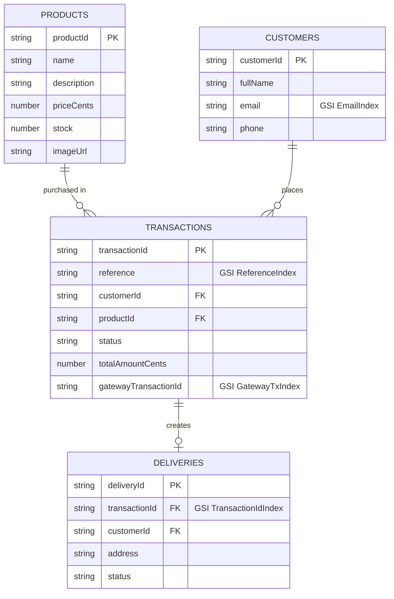

# Product Checkout App

A mobile-first single-page checkout: pick a product, pay by credit card through a payment
gateway (sandbox), and follow the payment to its final status. Five steps: **product page →
credit card & delivery info → summary → final status → product page (stock updated)**. Guest
checkout — no accounts — and the progress survives a page refresh.

Monorepo, three packages:

| Package | What it is |
|---|---|
| [`backend/`](./backend/README.md) | NestJS API — hexagonal architecture, Railway Oriented Programming |
| [`frontend/`](./frontend/README.md) | React + Redux Toolkit SPA — step machine, no router |
| [`infra/`](./infra/README.md) | AWS CDK — serverless deploy (CloudFront + S3, Lambda, DynamoDB) |

Each package README is the source of truth for its own internals; this document is the map.

## Table of contents

- [Live links](#live-links)
- [Brief requirements → where they are met](#brief-requirements--where-they-are-met)
- [Screenshots](#screenshots)
- [Architecture](#architecture)
- [Checkout flow](#checkout-flow)
- [Data model](#data-model)
- [API endpoints](#api-endpoints)
- [Security](#security)
- [Testing & coverage](#testing--coverage)
- [Local development](#local-development)
- [Deployment & CI/CD](#deployment--cicd)
- [Key decisions](#key-decisions)
- [Project structure](#project-structure)
- [Development process](#development-process)
- [Known limitations and next steps](#known-limitations-and-next-steps)

## Live links

<!-- LIVE_URLS -->
| Resource | URL |
|---|---|
| Web app | https://d17j4b8e1cjsp0.cloudfront.net |
| API base URL | https://z40rykuvgf.execute-api.us-east-1.amazonaws.com |
| Swagger UI | https://z40rykuvgf.execute-api.us-east-1.amazonaws.com/docs |
| OpenAPI JSON (import into Postman) | https://z40rykuvgf.execute-api.us-east-1.amazonaws.com/docs-json |
| Health check | https://z40rykuvgf.execute-api.us-east-1.amazonaws.com/health |
| Security headers scan (Mozilla Observatory: **A+**, 12/12) | https://developer.mozilla.org/en-US/observatory/analyze?host=d17j4b8e1cjsp0.cloudfront.net |

**Test cards (sandbox):** approved `4242 4242 4242 4242`, declined `4111 1111 1111 1111` — any holder name, a future expiry (e.g. `12/29`) and CVC `123`.

To import the API into Postman: *Import → Link* → paste the OpenAPI JSON URL.
<!-- /LIVE_URLS -->

## Brief requirements → where they are met

One row per requirement in the brief, in its order. "Partial" marks what is only partly done;
the gaps are listed in [Known limitations and next steps](#known-limitations-and-next-steps).

**Business process**

| Requirement | How it is met | Where |
|---|---|---|
| 1. Product page with description, price and units in stock | Catalog grid from `GET /products`; each card shows price, description and stock | [`features/catalog/`](./frontend/src/features/catalog/) |
| 2. "Pay with credit card" button opens a modal | The button on each product card opens the payment modal | [`ProductCard.tsx`](./frontend/src/features/catalog/ProductCard.tsx), [`PaymentModalContainer.tsx`](./frontend/src/features/checkout/PaymentModalContainer.tsx) |
| 3. Validated card data, VISA/MasterCard logos, delivery info | Luhn, expiry and CVC checks plus brand detection with a live logo; customer and delivery fields validated in the same form | [`domain/card/`](./frontend/src/domain/card/), [`customerDeliveryValidation.ts`](./frontend/src/domain/checkout/customerDeliveryValidation.ts) |
| 4. Summary (product amount, base fee, delivery fee) with Pay in a backdrop | Material-style backdrop: the product stays as the back layer, the summary sheet slides over it, Pay is gated on both consents | [`Summary.tsx`](./frontend/src/features/checkout/Summary.tsx) |
| 5.1 Create a PENDING transaction and get a transaction number | `POST /transactions` persists a `PENDING` row with a unique `reference` before calling the gateway | [Checkout flow](#checkout-flow), [`create-transaction.use-case.ts`](./backend/src/transactions/application/create-transaction.use-case.ts) |
| 5.2 Call the payment gateway | Server-side call with a server-computed amount and an integrity signature; the card is tokenized in the browser, so our backend never sees the card number or CVC | [`http-payment-gateway.adapter.ts`](./backend/src/shared/payment-gateway/infrastructure/http-payment-gateway.adapter.ts) |
| 5.3 Update the transaction, assign the product for delivery, update stock | One settle use case writes status + stock decrement + delivery in a single atomic `TransactWriteItems`; the sync result, the webhook and a lazy poll all go through it | [`settle-transaction.use-case.ts`](./backend/src/transactions/application/settle-transaction.use-case.ts), [`dynamo-transaction.repository.ts`](./backend/src/transactions/infrastructure/dynamo-transaction.repository.ts) |
| 6. Show the result, return to the product page with stock updated | Result screen polls until final; "Back to store" (automatic after 10 s on APPROVED) refetches the catalog | [`ResultContainer.tsx`](./frontend/src/features/transaction/ResultContainer.tsx) |

**Responsibilities**

| Requirement | How it is met | Where |
|---|---|---|
| API design and information architecture | One hexagonal module per bounded context, four DynamoDB tables | [Architecture](#architecture), [Data model](#data-model) |
| Request/response per endpoint; Postman collection or public Swagger URL | Swagger UI at `/docs`, OpenAPI JSON at `/docs-json` (Postman: *Import → Link*) | [Live links](#live-links), [API endpoints](#api-endpoints) |
| Real-life validations per endpoint | Whitelist DTO validation (unknown field → 400), UUID ids, 404 unknown product, 409 insufficient stock, server-side price, idempotent retries (a replay returns the original before any validation), rate limits | [backend § Key decisions](./backend/README.md#key-decisions) |
| Safe handling of sensitive data | Card tokenized in the browser; the card token is never persisted server-side; gateway secrets in SSM; PII masked on reads | [Security](#security) |
| API with stock, transactions, customers and deliveries, with different request types | `GET` + `POST` endpoints; customers and deliveries are written inside `POST /transactions` and only exposed as `GET` on their own | [API endpoints](#api-endpoints) |
| UI with products and units in stock | See business step 1 | [Screenshots](#screenshots) |
| Recover the buyer's progress after a refresh | Every step survives a refresh: step, selection, customer/delivery, a non-card form draft and the in-flight transaction in `localStorage`; the card token in `sessionStorage` on SUMMARY only; card number, expiry and CVC never stored; an in-flight payment is looked up by its idempotency key on boot | [frontend § Persistence model](./frontend/README.md#persistence-model) |
| 5-step flow | Step machine `PRODUCT → DETAILS → SUMMARY → RESULT → PRODUCT` | [`stepMachine.ts`](./frontend/src/domain/checkout/stepMachine.ts) |
| Attention to detail | Focus trap, `aria-live` status, 44px touch targets, reduced motion, expiry auto-format, E.164 phone | [frontend § Accessibility](./frontend/README.md#accessibility), [§ Checkout UX details](./frontend/README.md#checkout-ux-details) |

**Development rules**

| Requirement | How it is met | Where |
|---|---|---|
| SPA in React or Vue | React 18 + Vite, no router | [frontend/README.md](./frontend/README.md) |
| Mobile-first, multiple screen sizes, iPhone SE minimum | Mobile-first from 375px, breakpoints at 480/768/1024px; checked at iPhone SE 375×667 (the brief's 750×1334 physical pixels) | [frontend § Responsive design](./frontend/README.md#responsive-design) |
| Redux/Vuex following Flux; payment data stored securely | Redux Toolkit; only `persistMiddleware` writes Web Storage, from a whitelist, validated on boot | [frontend § Flux data flow](./frontend/README.md#flux-data-flow), [§ Persistence model](./frontend/README.md#persistence-model) |
| Own UX design | Own design (store "Lumila") | [Screenshots](#screenshots) |
| CSS of choice, flexbox/grid encouraged | Hand-written CSS Modules and a token sheet, no CSS framework; grid for the catalog, flexbox elsewhere | [`styles/tokens.css`](./frontend/src/styles/tokens.css), [`ProductGrid.module.css`](./frontend/src/features/catalog/ProductGrid.module.css) |
| Backend in NestJS / TypeScript | NestJS + TypeScript (strict) | [backend/README.md](./backend/README.md) |
| Business logic out of controllers; hexagonal, ports & adapters | `domain/` → `application/` → `infrastructure/` per module; controllers only call `.match()` | [backend § Architecture](./backend/README.md#architecture) |
| ROP in the use cases | Every use case returns `ResultAsync` (`neverthrow`) chained with `andThen`; one error-to-HTTP mapper | [`create-transaction.use-case.ts`](./backend/src/transactions/application/create-transaction.use-case.ts), [`error-http.mapper.ts`](./backend/src/shared/errors/error-http.mapper.ts) |
| Any database; data model in the README | DynamoDB, four tables | [Data model](#data-model) |
| ORM / serialization of choice | AWS SDK v3 document client; `class-validator` + `class-transformer` DTOs | [`dynamo-transaction.repository.ts`](./backend/src/transactions/infrastructure/dynamo-transaction.repository.ts) |
| Seeded dummy products, no create-product endpoint | `npm run seed` (also run by the deploy) seeds 12 products; there is no create-product endpoint | [`seed-products.ts`](./backend/scripts/seed-products.ts) |
| Jest unit tests, >80% coverage front and back, results in the README | Jest in all three packages; CI fails under 80% | [Testing & coverage](#testing--coverage) |
| Deploy on a cloud provider | AWS: CloudFront + S3, API Gateway HTTP API + Lambda, DynamoDB | [Live links](#live-links), [Deployment & CI/CD](#deployment--cicd) |

**Considerations**

| Requirement | How it is met | Where |
|---|---|---|
| Sandbox only | All gateway keys and URLs are sandbox ones; a sandbox-only test-card helper in the form | [frontend § Checkout UX details](./frontend/README.md#checkout-ux-details) |
| Use AI as a coding assistant | Built with AI assistance under Spec-Driven Development | [Development process](#development-process) |
| Branches and PRs per feature | `feature/*` / `fix/*` branches, one PR per change into `develop`, then `main` | [PR history](https://github.com/Wgutierrezl/product-checkout-app/pulls?q=is%3Apr) |
| Public repository, company name not used | Public repo; the gateway is only called "the payment gateway" | — |

**Deliverables and rubric**

| Requirement | How it is met | Where |
|---|---|---|
| Frontend app and backend API completed | Both deployed and working together | [Live links](#live-links) |
| GitHub link with an updated README | This README plus one per package | — |
| Deployed app connected to the backend | CloudFront SPA calling the HTTP API | [Live links](#live-links) |
| [5] README completed | Setup, architecture, data model, API, coverage, this map | This document |
| [5] Images render fast, nothing out of bounds | Responsive `srcset` (320/480/640/960 px WebP) with `sizes` matched to the grid columns, explicit `width`/`height` and a 1:1 `aspect-ratio` (no layout shift), lazy loading below the fold, the first desktop row eager with `fetchpriority="high"` on the first image, clamped text. Images are still hotlinked from Unsplash, not served from our CDN | [`ProductCard.tsx`](./frontend/src/features/catalog/ProductCard.tsx) |
| [20] Full credit-card checkout onboarding | The five steps work end to end on the live app with the sandbox test cards | [Checkout flow](#checkout-flow) |
| [20] API working correctly | 25 e2e tests against the real `AppModule` and DynamoDB Local, plus the unit suite | [backend § End-to-end tests](./backend/README.md#end-to-end-tests) |
| [30] >80% unit coverage, backend and frontend | Backend 100%, frontend >98% on every metric | [Testing & coverage](#testing--coverage) |
| [20] App and API deployed on a cloud provider | Three CDK stacks (`DataStack`, `WebStack`, `ApiStack`) deployed by GitHub Actions over OIDC on every push to `main` | [Deployment & CI/CD](#deployment--cicd), [infra § Stacks](./infra/README.md#stacks) |
| [Bonus 5] OWASP, HTTPS, security headers | HTTPS only, HSTS, strict CSP, `Permissions-Policy` (camera, microphone, geolocation, payment, usb off), `helmet()`; Mozilla Observatory **A+** (12/12). **Partial:** CSP `connect-src` is a regional wildcard | [Security](#security) |
| [Bonus 5] Responsive, works across browsers | **Partial.** Checked manually in Chromium, Firefox and Safari on an iPhone, down to iPhone SE 375×667; no automated cross-browser run | [frontend § Responsive design](./frontend/README.md#responsive-design) |
| [Bonus 10] CSS skills | CSS Modules and design tokens, no framework; grid/flexbox, bottom sheet under 768px, `dvh` with a `vh` fallback, `prefers-reduced-motion` | [frontend § Responsive design](./frontend/README.md#responsive-design) |
| [Bonus 10] Clean code | Strict TypeScript, pure domain functions, container/presentational split, ports with in-memory fakes in tests | [frontend § Architecture](./frontend/README.md#architecture), [backend § Architecture](./backend/README.md#architecture) |
| [Bonus 10] Hexagonal architecture, ports & adapters | `domain/` has no framework or AWS imports; repositories and the gateway are ports with DynamoDB/HTTP adapters | [backend § Architecture](./backend/README.md#architecture) |
| [Bonus 10] ROP | `AppResultAsync<T>` across use cases; failures are values, no `try/catch` in controllers | [backend § Architecture](./backend/README.md#architecture) |

## Screenshots

Captured from the live production app (store "Lumila").

**Mobile (375px, the primary breakpoint):**

<table>
<tr>
<td align="center" width="180"><br><sub>Catalog</sub></td>
<td align="center" width="180"><br><sub>Payment details (sandbox helper)</sub></td>
<td align="center" width="180"><br><sub>Order summary</sub></td>
</tr>
<tr>
<td align="center" width="180"><br><sub>Processing</sub></td>
<td align="center" width="180"><br><sub>Approved</sub></td>
<td align="center" width="180"><br><sub>Declined</sub></td>
</tr>
</table>

**Desktop (1440px, 4-column catalog grid):**

<table>
<tr>
<td align="center"><br><sub>Catalog</sub></td>
<td align="center"><br><sub>Approved</sub></td>
</tr>
</table>

## Architecture


- **Frontend** — React 18 SPA (Vite), Redux Toolkit as the Flux store, a step machine
  (`PRODUCT → DETAILS → SUMMARY → RESULT`) instead of a router, and a persistence
  whitelist: progress and a non-card form draft in `localStorage`, the single-use card token in
  `sessionStorage` while on SUMMARY only, and card number, expiry and CVC never stored. See
  [frontend/README.md](./frontend/README.md).
- **Backend** — NestJS, Hexagonal Architecture (Ports & Adapters): each bounded context
  (`products`, `customers`, `transactions`, `deliveries`, `payment-acceptance`) has a
  `domain/` (entities, value objects, repository ports — no framework/AWS imports),
  `application/` (use cases), and `infrastructure/` (DynamoDB repositories, HTTP controllers)
  layer. Every use case returns `AppResultAsync<T>` (`neverthrow`'s `ResultAsync`) and
  propagates failures as values — controllers only call `.match(onOk, onErr)`, no
  `try/catch`, no ad hoc status codes. See [backend/README.md](./backend/README.md).
- **Infra** — AWS CDK (TypeScript), 3 stacks deployed together (`DataStack`, `WebStack`,
  `ApiStack`) plus a `GithubOidcStack` bootstrap deployed once, manually, before the others
  exist. See [infra/README.md](./infra/README.md).

## Checkout flow

The payment sequence, covering tokenization, idempotency, and the three ways a transaction
gets settled:



The sandbox is a shared account where our webhook URL can't be registered, so in practice the
lazy poll is what settles transactions; the webhook endpoint is implemented and tested for a
real merchant setup.

A retried `POST /transactions` with the same `idempotencyKey` returns the original transaction
before any product, stock or price validation, and never charges the gateway twice (so a retry of
the purchase that took the last unit gets its transaction back, not a 409). All three settlement paths (synchronous result, webhook, lazy poll)
funnel through one use case, so a race between any two of them can never double-apply the
`APPROVED` side effects — enforced atomically by a single DynamoDB `TransactWriteItems` on the
transaction, product stock, and delivery. Details:
[backend/README.md § Key decisions](./backend/README.md#key-decisions).

## Data model

Four DynamoDB tables, one per aggregate:



| Table | Partition key | GSIs | Purpose |
|---|---|---|---|
| `Products` | `productId` | — | Direct get; catalog listing via `Scan` |
| `Customers` | `customerId` | `EmailIndex` (`email`) | Upsert-by-email dedupe on checkout (an `EMAIL#` guard item enforces one customer per email) |
| `Transactions` | `transactionId` (= the idempotency key) | `ReferenceIndex` (`reference`), `GatewayTxIndex` (`gatewayTransactionId`) | Idempotency through the partition key; webhook lookup by gateway id, falling back to reference |
| `Deliveries` | `deliveryId` | `TransactionIdIndex` (`transactionId`) | Embed a delivery on `GET /transactions/:id` |

## API endpoints

Full interactive documentation (request/response schemas, examples) is at `<api>/docs`; the raw
OpenAPI document is at `<api>/docs-json` and imports directly into Postman.

| Method | Path | Purpose |
|---|---|---|
| `GET` | `/health` | Liveness probe |
| `GET` | `/products` | List every product available for checkout |
| `GET` | `/products/:id` | Product detail, including current stock |
| `GET` | `/payment-acceptance` | Server-side proxy for the gateway's acceptance tokens |
| `POST` | `/transactions` | Create a checkout transaction (server-computed price, synchronous gateway call) |
| `GET` | `/transactions/:id` | Poll a transaction; self-heals a stale `PENDING` via a lazy poll |
| `POST` | `/transactions/webhook` | Gateway webhook — checksum-verified |
| `GET` | `/customers/:id` | Customer detail (partially masked — no auth layer) |
| `GET` | `/deliveries/:id` | Delivery detail (partially masked — no auth layer) |

## Security

Guest checkout, by design — no login, no session. That only stays safe with these controls in
place (mapped loosely to OWASP concerns):

| Concern | Control |
|---|---|
| Sensitive data exposure | Card PAN/CVC never reach this backend or any storage — tokenized directly in the browser against the payment gateway; only a single-use token crosses our API |
| Secrets management | Gateway secrets live in SSM Parameter Store as `SecureString`, fetched by the Lambda at cold start — never configured as Lambda environment variables, never in source control |
| Broken access control | Least-privilege IAM: the Lambda can only read/write the 4 checkout tables (+ `TransactWriteItems`) and `ssm:GetParameters` on exactly the 3 gateway secrets, with `kms:Decrypt` limited to calls made through SSM |
| Credential exposure in CI/CD | Deploys authenticate via GitHub OIDC (`aws-actions/configure-aws-credentials`) — no long-lived AWS keys stored anywhere |
| Transport security | HTTPS everywhere: CloudFront redirects HTTP→HTTPS; the API is only ever called over HTTPS |
| Security misconfiguration | CloudFront response-headers policy (HSTS, `X-Content-Type-Options: nosniff`, `X-Frame-Options: DENY`, `Referrer-Policy: strict-origin-when-cross-origin`, `Permissions-Policy` denying camera, microphone, geolocation, payment and usb) and a strict Content-Security-Policy; `helmet()` on the API |
| Cross-origin abuse | CORS allowlist (`CORS_ALLOWED_ORIGINS`) — only the deployed SPA origin (and `localhost` in dev) may call the API |
| Denial of service | Per-route rate limiting (`@nestjs/throttler`); `/health` and the webhook are explicitly exempt so gateway retries and health checks are never throttled away |
| Injection / mass assignment | Global `ValidationPipe` with `whitelist` + `forbidNonWhitelisted` + `transform` — any unknown field on a request body is rejected, never silently dropped or passed through |
| PII exposure | `GET /customers/:id` and `GET /deliveries/:id` partially mask email, phone, and address — reachable without auth, so they're masked by default |
| Tampering | A server-side integrity signature (SHA-256, server-only secret) travels with every gateway charge request; the incoming webhook is checksum-verified before use |

Full rationale, including how guest checkout stays safe without an auth layer, is in
[backend/README.md § Key decisions](./backend/README.md#key-decisions).

## Testing & coverage

All three packages are developed strict-TDD (RED → GREEN → REFACTOR); CI enforces an **80%
coverage gate on every PR** (`jest.config.ts` in each package). Numbers below were measured
on `develop` (`npm test -- --coverage` in each package; `npm run test:e2e` for the e2e row):

| Package | Statements | Branches | Functions | Lines | Suites / Tests |
|---|---|---|---|---|---|
| `backend` (unit) | 100% | 100% | 100% | 100% | 49 suites / 412 tests |
| `backend` (e2e) | — | — | — | — | 1 suite / 25 tests (DynamoDB Local) |
| `frontend` | 99.58% | 98.44% | 100% | 99.55% | 55 suites / 713 tests |
| `infra` | 100% | 100% | 100% | 100% | 6 suites / 40 tests |

- **Backend e2e** runs against a real `AppModule` and DynamoDB Local, with a deterministic
  fake gateway adapter (no network) — covers the full happy path, declined path, insufficient
  stock, validation, webhook checksum, and hardening (headers, CORS, rate limiting).
- **Frontend** gaps are documented, unreachable defensive guard clauses (e.g. a disabled
  control's own handler) — never left silently uncovered.
- **Infra** tests assert stack shape (`assertions`) against a fixture Lambda asset — no AWS
  account or credentials needed.

Run any package's suite yourself: `npm test -- --coverage` in `backend/`, `frontend/`, or
`infra/`. See each package's README for the full testing approach.

## Local development

1. **Backend** — `docker compose up -d` (DynamoDB Local), copy `.env.example` to `.env`,
   `npm install && npm run seed && npm run start:dev`. Full details:
   [backend/README.md § Running locally](./backend/README.md#running-locally).
   The e2e suite (`npm run test:e2e`) drops its tables, so it needs a separate DynamoDB Local on
   port 8001: `docker run -d --rm -p 8001:8000 --name checkout-dynamodb-e2e amazon/dynamodb-local`.
   It reads `E2E_DYNAMO_ENDPOINT` (default `http://localhost:8001`) and refuses to run against
   port 8000, so the dev tables are never dropped (see [backend/README.md § End-to-end tests](./backend/README.md#end-to-end-tests)).
2. **Frontend** — copy `.env.example` to `.env.local`, fill in the three `VITE_*` variables,
   `npm install && npm run dev` (`http://localhost:5173`). Full details:
   [frontend/README.md § Running locally](./frontend/README.md#running-locally).
3. **Infra** — no AWS account needed to work on it: `npm install && npm test` and
   `npx cdk synth --all` run fully offline. Deploying for real needs the one-time
   prerequisites in [infra/README.md](./infra/README.md#manual-prerequisites-one-time-per-aws-accountregion).

## Deployment & CI/CD

Branch flow: `feature/*` / `fix/*` → PR into `develop` (CI runs typecheck, frontend lint, tests
with coverage, and an offline `cdk synth`) → PR into `main` → push to `main` triggers
`deploy.yml`, which deploys all 3 CDK stacks via GitHub Actions OIDC (no static AWS keys),
seeds the product catalog, builds and uploads the SPA, and invalidates CloudFront.

One-time setup (CDK bootstrap, the `GithubOidcStack`, SSM secrets, GitHub variables) is
documented in [infra/README.md](./infra/README.md#manual-prerequisites-one-time-per-aws-accountregion)
and only needs to run once per AWS account/region.

## Key decisions

- **Serverless (Lambda + HTTP API) over containers** — no idle cost, no cluster to manage, and
  the workload (a demo-scale checkout API) never needs to hold a persistent connection.
- **DynamoDB, one table per aggregate** — rejected a single-table design: there are no
  fan-out access patterns in scope, and a repo-per-aggregate design maps directly onto the
  hexagonal repository ports, which keeps the code reviewable.
- **AWS CDK over Terraform** — same language (TypeScript) as the backend, so stack code and
  application code share tooling, types, and CI; no separate HCL toolchain to maintain.
- **SSM Parameter Store over Secrets Manager** — both encrypt with KMS and are governed by IAM;
  Secrets Manager's real advantage is automatic rotation, which can't apply to keys issued by a
  third-party gateway. `SecureString` parameters give the same protection at no cost.
- **Idempotency key = transaction id** — a client-generated UUID v4 doubles as the DynamoDB
  partition key: a replay is a `GetItem` on that id before any validation, and a conditional put
  guards two concurrent first requests, with no separate idempotency table.
- **Ambiguous gateway failures stay `PENDING`, never `ERROR`** — a timeout, network error, or
  5xx means the charge may have gone through; only an explicit 4xx rejection (the gateway never
  processed the request) is definite enough to mark a transaction `ERROR`.
- **Tokenize at "Continue"**, not at final submit — the card is tokenized as soon as the payment
  form is completed, so the token (and any tokenization failure) is known before the buyer ever
  reaches the order summary.
- **Guest checkout, no auth layer** — the take-home scope is a single purchase flow, not an
  account system; the protections that make that safe (rate limiting, PII masking, strict
  input validation, price always computed server-side) are listed under
  [Security](#security).

## Project structure

```
.
├── backend/    NestJS API — hexagonal architecture (domain/application/infrastructure per module)
│   ├── src/      products, customers, transactions, deliveries, payment-acceptance, shared, health
│   └── test/     e2e suite (DynamoDB Local + fake gateway adapter)
├── frontend/   React + Redux Toolkit SPA
│   └── src/      domain (pure logic), api (HTTP clients), app (store), features, shared/ui
├── infra/      AWS CDK app
│   ├── bin/      app.ts (3 stacks) and oidc.ts (bootstrap stack, deployed separately)
│   └── lib/      DataStack, WebStack, ApiStack, GithubOidcStack
└── .github/
    └── workflows/  ci.yml (PR checks) and deploy.yml (OIDC deploy on push to main)
```

## Development process

Built with Spec-Driven Development (SDD): each change starts as a written proposal and spec
before any code, with AI assistance directing implementation rather than freehand prompting.
Strict TDD (RED → GREEN → REFACTOR) throughout, one feature branch and PR per change, and
adversarial review passes (a fresh reviewer, blind to the author's reasoning, checks the diff
before merge) ahead of every merge into `develop`.

## Known limitations and next steps

Consciously left out of this scope, each with the reason or the next step:

- **Three error body shapes.** Domain errors use `{ statusCode, error, message, path, timestamp }`
  (`DomainErrorFilter`), validation errors use Nest's default `{ statusCode, message[], error }`,
  and a 429 uses the throttler's `{ statusCode, message }`. Next: one global filter emitting an
  `ErrorResponseDto`, with the error schemas and the 429 documented in Swagger.
- **A definite gateway rejection answers 502, but its replay answers 201 `ERROR`.** The first
  call propagates the 4xx as `PaymentGatewayError`; a replay returns the stored `ERROR` row.
  Next: align both on the same status code.
- **A replay with a different body under the same key returns the original silently.** Safe (no
  second charge), but a mismatched body could get a 409/422 instead.
- **Product images are hotlinked from Unsplash**, not served from our CDN. Next: copy them to
  our own CloudFront distribution.
- **Google Fonts is render-blocking.** Next: self-host the two font families.
- **The CSP `connect-src` allows any `execute-api` host in the region** (to avoid a circular
  stack dependency, see [infra § Stacks](./infra/README.md#stacks)). Next: pin it to the API id.
- **The e2e suite is not run in CI**, because it needs a DynamoDB Local service container. Next:
  add that service to `ci.yml` and run `npm run test:e2e`.
- **WebKit is not automated in CI.** Safari was checked manually on an iPhone; there is no
  browser-automation suite yet.
- **GitHub Actions are pinned to tags, not commit SHAs** — see
  [infra § Hardening Next Steps](./infra/README.md#hardening-next-steps).
