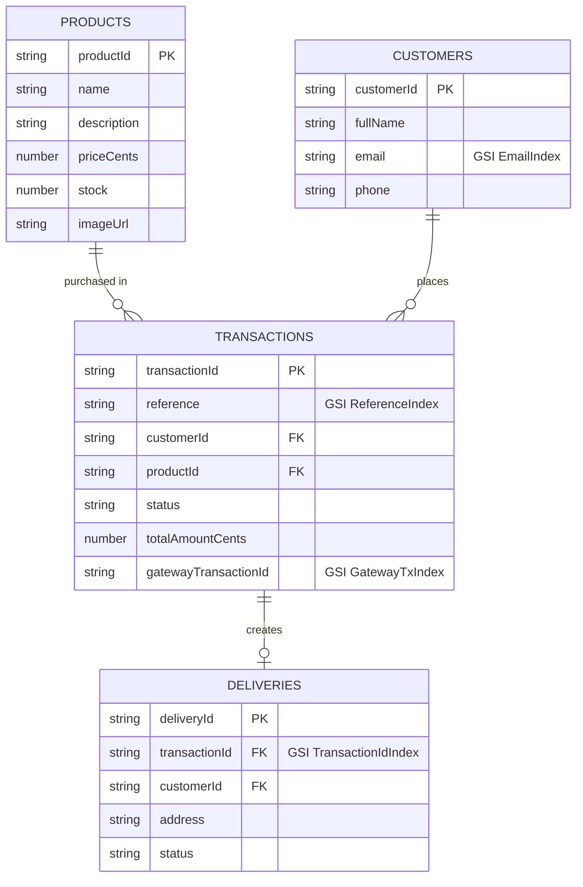

# Backend — Product Checkout API

NestJS API for the product checkout flow: catalog, payment-gateway proxy, checkout transactions,
customers, and deliveries. Built with Hexagonal Architecture (Ports & Adapters) and Railway
Oriented Programming (ROP) via [`neverthrow`](https://github.com/supermacro/neverthrow).

## Running locally

### 1. Prerequisites

- Node.js 20+
- Docker (for DynamoDB Local)

### 2. Environment

Copy `.env.example` to `.env` and fill in the values (`PAYMENT_GATEWAY_*` credentials point at a
sandbox environment for the payment gateway integration; `CORS_ALLOWED_ORIGINS` is a
comma-separated allowlist). See [`src/shared/config/env.validation.ts`](./src/shared/config/env.validation.ts)
for the full list of variables, their defaults, and validation rules.

### 3. Start DynamoDB Local

```bash
docker compose up -d
```

Runs `amazon/dynamodb-local` on `localhost:8000` (in-memory, data is lost on stop — that's
intentional for local dev).

### 4. Install dependencies and seed the catalog

```bash
npm install
npm run seed   # creates the 4 tables (idempotent) and seeds 7 sample products
```

### 5. Run the API

```bash
npm run start:dev   # watch mode
# or
npm run build && npm run start:prod   # production build
```

The API listens on `PORT` (default `3000`). Swagger UI is served at `/docs` (and the raw document
at `/docs-json`) in every environment, including production — this is a take-home test and a
publicly reachable API reference is part of the deliverable.

## Scripts

| Script | What it does |
|---|---|
| `npm run build` | `nest build` (compiles to `dist/`, real entrypoint is `dist/src/main.js`) |
| `npm run start` | Run the compiled-on-the-fly Nest app once |
| `npm run start:dev` | Run with file-watch + auto-restart |
| `npm run start:prod` | Run the built output (`node dist/src/main`) |
| `npm test` | Unit test suite (Jest, mirrors `src/`) |
| `npm run test:watch` | Unit tests in watch mode |
| `npm run test:e2e` | End-to-end suite against a real `AppModule` + DynamoDB Local (see below) |
| `npm run seed` | Create/ensure the 4 DynamoDB tables and seed the product catalog |
| `npm run swagger:export` | Write the full OpenAPI document to `openapi.json` (README linking / Postman import), without needing a running HTTP server |

## Testing

### Unit tests

```bash
npm test -- --coverage
```

Unit tests live alongside the code they test (`*.spec.ts` next to each `.ts` file) — domain value
objects and entities with plain Jest, application use cases against in-memory fake ports, and
adapters (DynamoDB repositories, the HTTP payment-gateway adapter) with `aws-sdk-client-mock` /
mocked `fetch`. The CI gate is 80% (`jest.config.ts`); current numbers:

| Metric | Covered / Total | % |
|---|---|---|
| Statements | 1058 / 1058 | 100% |
| Branches | 288 / 288 | 100% |
| Functions | 266 / 266 | 100% |
| Lines | 987 / 987 | 100% |

378 tests across 44 suites, developed strict-TDD (RED → GREEN → REFACTOR) throughout.

### End-to-end tests

```bash
docker compose up -d          # DynamoDB Local must be running
npm run test:e2e
```

Uses a **separate Jest config** (`test/jest-e2e.json`, its own `npm run test:e2e` script — never
part of the unit coverage gate) and `supertest` against the real `AppModule`, with:

- **Real DynamoDB Local**: all 4 tables are dropped and recreated at the start of every run
  (`test/e2e/support/dynamo-e2e.support.ts`), then seeded with 2 fixed test products — no shared
  state with `npm run seed`'s catalog, no cross-run pollution.
- **A deterministic, no-network fake gateway** (`test/e2e/support/fake-payment-gateway.adapter.ts`)
  injected via `overrideProvider(PAYMENT_GATEWAY_PORT)` — the real gateway is never called. A
  known card token settles synchronously DECLINED; any other token settles PENDING synchronously
  (mirroring the real sandbox's observed behavior) and resolves APPROVED on the first poll, so the
  suite exercises the actual lazy-poll code path, not just a shortcut.

17 tests cover: catalog listing/detail (400 malformed id, 404 unknown id), the payment-acceptance
proxy, the full happy path (create → PENDING → lazy-polled to APPROVED → stock decremented →
delivery embedded → idempotent replay → masked customer/delivery reads), the declined path,
insufficient stock (409), whitelist validation (400 on an unknown extra field), an invalid webhook
checksum (400), and a hardening block: helmet headers, CORS allowlist behavior, per-route rate
limiting (429, with `/health` and the webhook explicitly exempt), and "no stack trace in any error
body".

## Architecture

Hexagonal ("Ports & Adapters") monolith, one bounded-context module per folder, each with the same
3-layer shape:

```
src/
├── main.ts                 # NestFactory.create + listen
├── lambda.ts                # same AppModule, wrapped for API Gateway + Lambda
├── app.module.ts
├── shared/                  # cross-cutting kernel — never depends on a feature module
│   ├── config/               # env validation (class-validator) + typed AppConfig
│   ├── errors/                # DomainError hierarchy + HTTP status mapper + global exception filter
│   ├── result/                 # neverthrow re-exports (AppResult/AppResultAsync)
│   ├── ports/                   # ClockPort, IdGeneratorPort (testability seams)
│   ├── infrastructure/           # DynamoDB client provider, clock/id adapters
│   ├── payment-gateway/            # generic PaymentGatewayPort + the ONE adapter that knows the vendor's HTTP shape
│   ├── pii/                         # partial-masking helpers (email/phone/address)
│   └── swagger/                      # OpenAPI document builder
├── products/    customers/    deliveries/    transactions/    payment-acceptance/
│   ├── domain/          # entities, value objects, repository port interfaces — zero framework/AWS imports
│   ├── application/     # use cases: ROP pipelines built with neverthrow (`ResultAsync.andThen` chains)
│   └── infrastructure/  # DynamoDB repository, HTTP controller, DTOs
└── health/
```

**Railway Oriented Programming**: every use case returns `AppResultAsync<T> = ResultAsync<T,
DomainError>`. A single mapper at the controller boundary (`DomainErrorFilter` +
`mapDomainErrorToHttpStatus`) converts a `DomainError` into the right HTTP status — controllers
themselves only ever call `.match(onOk, onErr)` and stay free of any `try/catch` or status-code
logic.

**Settlement is the one place true DynamoDB transactions are used**: `TransactWriteItems`
atomically transitions a transaction to `APPROVED`, decrements the product's stock, and creates the
delivery — all three or none.

## Data model

4 DynamoDB tables, one per aggregate (rejected a single-table design — no fan-out access patterns
in scope, and per-aggregate tables keep a hexagonal repo-per-aggregate design reviewable for a
take-home test):



| Table | Partition key | GSIs | Purpose |
|---|---|---|---|
| `Products` | `productId` | — | Direct get; catalog listing via `Scan` (a handful of items) |
| `Customers` | `customerId` | `EmailIndex` (`email`) | Upsert-by-email dedupe on checkout |
| `Transactions` | `transactionId` | `ReferenceIndex` (`reference`), `GatewayTxIndex` (`gatewayTransactionId`) | Idempotency on create; webhook lookup by gateway id |
| `Deliveries` | `deliveryId` | `TransactionIdIndex` (`transactionId`) | Embed a delivery on `GET /transactions/:id` |

## API endpoints

Full interactive documentation (with request/response schemas and examples) is at `/docs`
(`/docs-json` for the raw OpenAPI document, or run `npm run swagger:export` to write it to
`openapi.json`).

| Method | Path | Description |
|---|---|---|
| `GET` | `/health` | Liveness probe — never rate-limited |
| `GET` | `/products` | List every product available for checkout |
| `GET` | `/products/:id` | Product detail, including current stock |
| `GET` | `/payment-acceptance` | Server-side proxy for the gateway's acceptance tokens |
| `POST` | `/transactions` | Create a checkout transaction (server-computed price, synchronous gateway call) |
| `GET` | `/transactions/:id` | Poll a transaction; self-heals a stale `PENDING` status via a lazy poll |
| `POST` | `/transactions/webhook` | Gateway webhook — checksum-verified, never rate-limited |
| `GET` | `/customers/:id` | Customer detail (partially masked — no auth layer) |
| `GET` | `/deliveries/:id` | Delivery detail (partially masked — no auth layer) |

## Key decisions

- **Idempotent checkout**: `POST /transactions` takes a client-generated `idempotencyKey` (UUID
  v4), used directly as the transaction's row id. A retried request (e.g. after a network timeout)
  with the same key lands on the same row and **never charges the gateway a second time** — the
  create pipeline only calls the gateway when the row was actually just inserted
  (`wasCreated: true`).
- **Hybrid settlement** (sync call + webhook + lazy poll), not webhook-only: no public webhook URL
  exists for this deployment yet, so `GET /transactions/:id` self-heals a stale `PENDING` status by
  polling the gateway directly. All three paths (the synchronous `POST /transactions` result, the
  webhook, and the lazy poll) funnel through **one** `SettleTransactionUseCase`, so a race between
  any two of them can never double-apply the `APPROVED` side effects (stock decrement + delivery
  creation) — the loser re-reads and returns the already-settled state as a no-op. Enforced
  atomically at the DynamoDB layer with a single `TransactWriteItems` conditioned on the
  transaction still being `PENDING`.
- **Ambiguous vs. definite gateway failures**: a network error, timeout, 5xx, or a malformed body
  after a 2xx is treated as AMBIGUOUS — the charge may have gone through, so the transaction is
  left `PENDING` (not `ERROR`) and the client polls to resolve it. Only an explicit 4xx rejection
  (the gateway never processed the request) is DEFINITE and marks the transaction `ERROR`. A
  **persistence failure that happens after a successful charge is never misclassified as a gateway
  rejection** — the two failure domains are kept structurally separate in `CreateTransactionUseCase`.
- **PII masking on unauthenticated reads**: this API has no auth layer, so a `customerId` /
  `deliveryId` is effectively guessable. `GET /customers/:id` partially masks email (`ja***@x.com`)
  and phone (`********4567`); `GET /deliveries/:id` partially masks the address and never returns
  `customerId`. Neither endpoint exists to let a third party harvest full PII from a guessed id.
- **Guest checkout, no auth layer** — protections in place instead:
  - Rate limiting (`@nestjs/throttler`, global guard) on every route except `/health` and the
    gateway webhook (legitimate gateway retries must never be throttled away — the checksum is the
    real security boundary there, not the rate limiter).
  - `helmet()` security headers, a CORS allowlist (`CORS_ALLOWED_ORIGINS`), and a strict
    `ValidationPipe` (`whitelist` + `forbidNonWhitelisted` + `transform`) rejecting any unknown
    field on every request body.
  - Price is **always** computed server-side from stored product data — never trusted from the
    request body.
  - Raw card data (PAN/CVC) never reaches this API — only a gateway-issued card token is accepted,
    and it is never persisted or logged.
  - Error responses never leak a stack trace; 5xx error types return a generic message to the
    client while the real message is logged server-side only.
