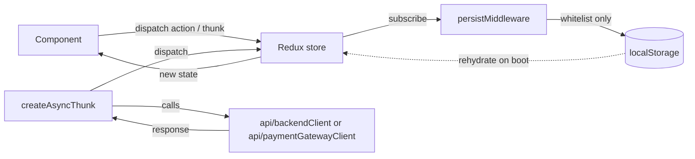

# Frontend — Lumila Checkout

A single-page checkout: pick a product, pay by card, track the payment to a final status. Built
with Vite + React 18 + TypeScript, Redux Toolkit, and hand-rolled CSS Modules — no router, no UI
framework, no `redux-persist`.

## Quick path

1. Start the [backend](../backend/README.md) (`docker compose up -d && npm run seed && npm run start:dev`, from `backend/`).
2. Copy `.env.example` to `.env.local` and fill in the three `VITE_*` variables (see [Running locally](#running-locally)).
3. `npm install && npm run dev` — open `http://localhost:5173`.

## Stack

| Layer | Choice | Why |
|---|---|---|
| Build tool | Vite | Fast dev server, native ESM, trivial `import.meta.env` handling |
| UI | React 18 (function components + hooks) | No router needed — see [Step machine](#step-machine-instead-of-a-router) |
| State | Redux Toolkit (`createSlice`, `createAsyncThunk`) | Predictable, easily testable state transitions for a multi-step flow |
| Styling | CSS Modules + a hand-written token sheet (`styles/tokens.css`) | Scoped class names without a CSS-in-JS runtime; full control over the design system |
| Testing | Jest + React Testing Library + `@testing-library/user-event` | Behavior-first tests; `babel-jest` (not `ts-jest`) so `import.meta.env` can be mocked directly |

## Architecture

### Folders

```
src/
├── main.tsx                    # React root, StrictMode
├── config/env.ts                # single point of access to import.meta.env (mockable in tests)
├── domain/                      # pure functions — zero React/Redux imports
│   ├── card/                     # Luhn, brand detection, expiry, CVC, formatting, masking, redaction
│   ├── catalog/                  # quantity bounds (1..min(10, stock))
│   ├── checkout/                 # step machine, idempotency key, order preview, poll backoff
│   └── money/                    # COP currency formatting
├── api/                         # two ISOLATED HTTP clients — see Security
│   ├── backendClient.ts          # this app's own backend
│   └── paymentGatewayClient.ts   # the card network's public tokenization endpoint ONLY
├── app/                         # store, typed hooks, <App>
├── features/
│   ├── catalog/                  # product list: container (Redux) + presentational components
│   ├── checkout/                 # payment modal, order summary, checkout slice + thunks
│   └── transaction/               # polling, final-status screen, transaction slice
├── shared/
│   ├── persistence/               # localStorage whitelist middleware
│   └── ui/                        # Modal, Backdrop, Button, Field, Spinner, icons/illustrations
└── styles/                       # tokens.css (design tokens), reset.css
```

Each feature follows the same **container / presentational** split: a `*Container.tsx` connects to
Redux and owns side effects; the plain component next to it takes props only, which keeps it the
easiest target for React Testing Library.

### Flux data flow



Unidirectional, one-way data flow — the only way a component changes app state is by dispatching an
action or thunk; the only way it reads state is via a typed selector. No component ever writes to
`localStorage` directly; only `persistMiddleware` does, and only for the whitelisted fields below.

### Step machine instead of a router

There are no pages to navigate between — the whole flow (`PRODUCT → DETAILS → SUMMARY → RESULT`)
is one screen with three possible overlays, driven by `checkout.step` in Redux
(`domain/checkout/stepMachine.ts`). `canEnterStep` gates every transition on prerequisites (a
product must be selected before `DETAILS`, customer+delivery before `SUMMARY`, a submitted payment
before `RESULT`), so an invalid deep-link or a stale persisted state can never strand the buyer on
a screen its data doesn't support. A router would add navigation/history semantics this flow never
needs, at the cost of splitting state that's naturally one machine.

### Store shape

```ts
interface CatalogState {
  items: Product[];
  status: 'idle' | 'loading' | 'succeeded' | 'failed';
  error: string | null;
}

interface CheckoutState {
  step: 'PRODUCT' | 'DETAILS' | 'SUMMARY' | 'RESULT';
  productId: string | null;
  quantity: number;
  customer: { fullName: string; email: string; phone: string } | null;
  delivery: { address: string; city: string; region: string; postalCode?: string } | null;
  installments: number;
  idempotencyKey: string | null;
  cardSummary: { brand: 'visa' | 'mastercard' | 'unknown'; last4: string; holder: string } | null;
  cardToken: string | null;          // single-use gateway token — see Security, NEVER persisted
  submitStatus: 'idle' | 'tokenizing' | 'fetchingAcceptance' | 'submitting' | 'failed';
  submitError: string | null;
  submitAttempted: boolean;          // true from just-before-POST until the outcome is known
}

interface TransactionState {
  id: string | null;
  status: 'PENDING' | 'APPROVED' | 'DECLINED' | 'VOIDED' | 'ERROR' | null;
  reference: string | null;
  amounts: { productAmount: number; baseFee: number; deliveryFee: number; total: number; currency: 'COP' } | null;
  error: string | null;
  pollStartedAt: number | null;
}
```

### Persistence whitelist

Storage key: `checkout-spa:v1`. The persisted payload also carries its own internal `version`
number (independent of the key name, currently `2`) — a mismatch on boot discards the whole
payload rather than risk rehydrating an old, incompatible shape. Only these fields ever reach
`localStorage`:

| Persisted | Never persisted | Why |
|---|---|---|
| `checkout.step`, `productId`, `quantity`, `customer`, `delivery`, `installments`, `idempotencyKey`, `cardSummary`, `submitAttempted` | `checkout.cardToken` | Single-use gateway token — must not outlive the tab (see Security) |
| `transaction.id`, `status`, `pollStartedAt` | `transaction.amounts`, `error` | Cheap to refetch via `GET /transactions/:id`; no reason to persist |
| — | `catalog.*` | Refetched on every boot so stock is always current |
| — | `checkout.submitStatus`, `submitError` | Transient UI state, meaningless across a reload |

On boot, if the persisted `step` is `SUMMARY`, it's downgraded to `DETAILS` and `cardSummary` is
cleared — the in-memory-only `cardToken` is gone after a refresh regardless, so the buyer always
re-enters card details rather than seeing a summary they can't actually pay from. Persisted state
is cleared entirely once a final transaction status is reached and the buyer returns to the
catalog.

## Security decisions

- **Card data is tokenized directly in the browser, never through this app's backend.** The card
  network's public tokenization endpoint is called with only a *public* key
  (`VITE_PAYMENT_GATEWAY_PUBLIC_KEY`); the backend never receives a PAN or CVC and cannot log or
  persist what it never sees.
- **PAN/CVC exist only in a form component's local `useState`**, are cleared immediately after a
  successful tokenize call (or on a failed attempt, forcing re-entry), and are never written to
  Redux or `localStorage`.
- **The resulting card token is single-use and kept in memory only** (`checkout.cardToken`,
  explicitly excluded from the persistence whitelist above). It survives navigating from the
  payment form to the order summary in the same tab, but never a refresh — by design, not by
  accident.
- **Acceptance tokens are fetched fresh immediately before every submission attempt**, never reused
  across attempts, matching the one-time-use contract the gateway expects of them.
- **Idempotency and refresh resume**: one `idempotencyKey` (UUID v4) is generated per checkout
  attempt and reused across retries of that *same* attempt; the backend persists a transaction
  under an id equal to that key, so `GET /transactions/:idempotencyKey` definitively answers "did
  this attempt already land?" without ever creating a second, untracked transaction. If the page is
  refreshed in the narrow window between clicking Pay and observing the response,
  `checkout.submitAttempted` (itself persisted) is checked exactly once, at boot, against that
  endpoint — resolved-on-boot only, deliberately never re-triggered by a live, current-session Pay
  click (that race was one of the bugs found in the live end-to-end run — see
  [Testing](#testing)).

## Accessibility

- The payment modal, order summary backdrop, and final-status screen all share one focus-trap /
  Escape-to-close / background-inert implementation (`shared/ui/useOverlayA11y`), rendered through
  a portal.
- Every form control is wired through `shared/ui/Field`, which auto-generates `aria-describedby`
  (error or hint) and `aria-invalid`.
- Status changes are announced via `aria-live` regions (loading, poll-exhausted "still processing",
  quantity stepper) or `role="status"`/`role="alert"` where more appropriate.
- All motion (modal/backdrop entrance, result icon draw-in, card hover lift) is disabled under
  `prefers-reduced-motion: reduce`.
- Interactive touch targets are at least 44×44px, even where the *visible* control is smaller (the
  quantity stepper's circular buttons use an invisible `::after` hit-area extension rather than
  growing visually).

## Responsive design

Mobile-first from 375px, with breakpoints at 480/768/1024px. The payment modal and order summary
render as a bottom sheet below 768px and a centered dialog above it — same accessibility contract,
different visual shell. `max-height` on both uses a `dvh` value alongside a `vh` fallback so mobile
Safari's collapsing address bar never clips the sheet. All text inputs use the base `1rem` (16px)
font size to avoid iOS Safari's automatic zoom-on-focus.

## Checkout UX details

A few refinements from a manual pass over the real checkout, on top of the flow above:

- **Card expiry auto-format** (`domain/card/format.ts#formatExpiryInput`): typing digits only
  ("1229") displays "12/29" as you go, a leading month digit that can't start a 2nd one (e.g. "4")
  auto-pads to "04/", and pasting "12/2029" or "12 / 2029" normalizes to "12/29" — all still
  validated through the existing `parseExpiry`/`isExpiryValid`.
- **Phone as E.164 with a country selector** (`domain/phone/`, `shared/ui/CountrySelect`): the
  phone field is a country combobox (flag + dial code, default Colombia, type-to-search by name or
  dial code) next to a digits-only national-number field. The value sent to the backend is always
  `+<dial><national>`; an existing plain/bare persisted phone is parsed as a Colombian national
  number so older customer data keeps working.
- **Symmetric catalog cards**: name/description are clamped to 2 lines each, and the price/stock
  row, quantity stepper, and pay action are pinned to the bottom of every card, so a grid row stays
  visually aligned regardless of how long each product's copy is.
- **A real "processing" state**: the PENDING result screen now shares the same card container and
  top accent stripe as the approved/declined outcomes, with a 3-step progress list instead of a
  bare spinner.
- **Clearer in-flight buttons**: tokenizing and paying show an in-button spinner + label (kept
  full-colour, not washed out) instead of a faded "Processing…", with the surrounding fields
  visually locked via a native `<fieldset disabled>`.

## Testing

Strict TDD throughout (RED → GREEN → REFACTOR), enforced by a coverage gate: 80% in
`jest.config.ts`, current numbers well above the 95% target:

| Metric | % |
|---|---|
| Statements | 99.48% |
| Branches | 98.07% |
| Functions | 100% |
| Lines | 99.44% |

51 suites / 543 tests. Remaining, documented gaps are defensive guard clauses unreachable via the
UI (e.g. a disabled control's own handler) — never left silently uncovered.

```bash
npm test               # run once
npm run test:watch     # watch mode
npm test -- --coverage # with the coverage table above
npm run typecheck      # tsc -b --noEmit
npm run lint           # eslint .
```

Layer-by-layer approach:

| Layer | What | Approach |
|---|---|---|
| Domain (`domain/**`) | Luhn, brand detection, money formatting, poll backoff | Pure unit tests, near-100% branch coverage |
| API adapters | Request shape, error mapping, abort/timeout handling | Mocked `fetch` |
| Slices/thunks | State transitions, submit sequencing | `configureStore` + dispatched thunks |
| Persistence | Whitelist, version discard, SUMMARY→DETAILS downgrade | jsdom `localStorage` |
| Components | Masking UX, focus trap, consent-gated Pay, backoff timers | RTL + `user-event` + fake timers |
| Integration | Full flow: select → form → submit → poll → result | Container-level RTL, real store + real `localStorage` |

Several genuine bugs were found only by walking the real checkout against a live backend and a
real sandbox gateway (never surfaced by the mocked unit suite, since none of it exercised React 18
StrictMode's dev-only double-invoke or a real response body) — each was reproduced as a failing
test first, then fixed:

1. The card tokenization response guard required a field the real gateway never sends, silently
   discarding every successful tokenization as "malformed".
2/3. The payment modal and the order summary's Pay action could both stall forever under
   StrictMode — an `isMountedRef` was initialized `true` once and never reset on the real remount.
4. The in-flight-payment resume check subscribed to live state changes instead of reading a
   one-time snapshot at boot, racing its own safety-net GET request against the real submission it
   was meant to protect.

## Running locally

### Prerequisites

- Node.js 20+
- The [backend](../backend/README.md) running (DynamoDB Local + `npm run start:dev`)

### Environment

Three `VITE_*` variables are required (see `src/config/env.ts` — the app fails fast at startup if
any are missing):

| Variable | Example | Purpose |
|---|---|---|
| `VITE_API_URL` | `http://localhost:3000` | This app's own backend base URL |
| `VITE_PAYMENT_GATEWAY_URL` | `https://api-sandbox.example/v1` | The card network's public API base URL |
| `VITE_PAYMENT_GATEWAY_PUBLIC_KEY` | `pub_test_xxxxx` | Public (non-secret) tokenization key — never the private key |

Copy `.env.example` to `.env.local` and fill these in (or export them inline before `npm run dev`
— never commit real values).

### Scripts

| Script | What it does |
|---|---|
| `npm run dev` | Vite dev server (`http://localhost:5173`) |
| `npm run build` | `tsc -b` then `vite build` (production bundle in `dist/`) |
| `npm run preview` | Serve the production build locally |
| `npm test` / `test:watch` / `test -- --coverage` | Jest unit suite |
| `npm run typecheck` | `tsc -b --noEmit` |
| `npm run lint` | `eslint .` |
