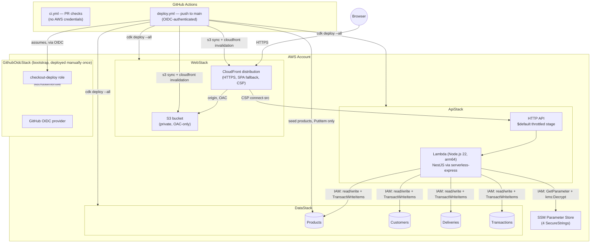

# Infra — AWS CDK App

CDK v2 TypeScript app deploying the checkout backend (NestJS on Lambda,
behind an HTTP API), the DynamoDB tables it uses, and the frontend SPA
(S3 + CloudFront). Designed to `cdk synth`/test with **zero AWS credentials
and zero context lookups** — no AWS account is required to work on this
code, only to actually deploy it.

## Architecture



## Stacks

| Stack | File | Depends on | Contains |
|---|---|---|---|
| `DataStack` | `lib/data-stack.ts` | none | 4 DynamoDB tables (`Products`, `Customers`, `Deliveries`, `Transactions`), PAY_PER_REQUEST, `RemovalPolicy.DESTROY` |
| `WebStack` | `lib/web-stack.ts` | none | Private S3 bucket + CloudFront distribution (OAC, HTTPS redirect, SPA fallback, security headers + CSP) |
| `ApiStack` | `lib/api-stack.ts` | `DataStack`, `WebStack` | Lambda (Node.js 22.x, arm64, 1024MB, 15s) + HTTP API, least-privilege IAM |
| `GithubOidcStack` | `lib/github-oidc-stack.ts` | none | **Bootstrap only** — GitHub OIDC provider + deploy role. Deployed manually, once, separately (see below) |

`ApiStack` depends on `WebStack` (for the CORS origin), so `WebStack` never
depends back on `ApiStack` — its CSP `connect-src` allows the wildcard
`https://*.execute-api.<region>.amazonaws.com` pattern instead of the exact
API URL, to avoid a circular stack dependency.

## Deploy Order

`cdk deploy --all` computes the dependency graph automatically from
`addStackDependency` calls in `bin/app.ts` — declaration order in that file
doesn't matter. In practice: `DataStack` and `WebStack` deploy first (no
dependencies between them), then `ApiStack`.

**`GithubOidcStack` is never part of `cdk deploy --all`** — it has its own
CDK app entry point (`bin/oidc.ts`) and is deployed separately, manually,
before the other 3 stacks exist (see Manual Prerequisites, step 2).

## Manual Prerequisites (one-time, per AWS account/region)

Run these once, with your own AWS credentials (e.g. `aws configure` or SSO
login) — never with static keys committed anywhere, and never as part of
any GitHub Actions workflow.

### 1. CDK bootstrap

```bash
cdk bootstrap aws://<ACCOUNT_ID>/<REGION>
```

### 2. Deploy the GitHub OIDC bootstrap stack

```bash
cd infra
CDK_DEFAULT_ACCOUNT=<ACCOUNT_ID> CDK_DEFAULT_REGION=<REGION> \
  npx cdk deploy \
  --app "npx ts-node --prefer-ts-exts bin/oidc.ts" \
  GithubOidcStack
```

This creates:
- The GitHub Actions OIDC identity provider (`token.actions.githubusercontent.com`).
- A `checkout-deploy` IAM role trusted **only** for
  `repo:Wgutierrezl@167873254/product-checkout-app@1384356068:ref:refs/heads/main`
  — no other repo, fork, or branch can assume it. This repository emits
  GitHub's *immutable* OIDC subject, which embeds the owner and repository ids,
  so even a deleted-and-recreated repo with the same name can't assume the role.
  Check your repository's format with
  `gh api repos/<owner>/<repo>/actions/oidc/customization/sub` and override the
  value with `GITHUB_OIDC_REPO` if it differs — a mismatch fails the deploy with
  `Not authorized to perform sts:AssumeRoleWithWebIdentity`.
- A policy scoped to exactly what `deploy.yml` needs: assuming the CDK
  bootstrap roles, syncing the SPA bucket, invalidating the CloudFront
  distribution, and `PutItem` on the `Products` table.

Note the `DeployRoleArn` output — you'll need it in step 4.

### 3. SSM SecureString parameters (payment gateway secrets)

`ApiStack` reads these 4 parameters at Lambda cold start (see
`backend/src/shared/config/ssm-bootstrap.ts`), under the prefix
`SSM_PARAM_PREFIX = /checkout/gateway` (see `lib/api-stack.ts` —
must match exactly, including this exact path, or the Lambda fails fast
on cold start with a "Missing SSM parameters" error):

```bash
aws ssm put-parameter --type SecureString \
  --name /checkout/gateway/private-key --value <PLACEHOLDER>

aws ssm put-parameter --type SecureString \
  --name /checkout/gateway/integrity-secret --value <PLACEHOLDER>

aws ssm put-parameter --type SecureString \
  --name /checkout/gateway/events-secret --value <PLACEHOLDER>

# Signing secret for the optional user accounts (at least 32 characters)
aws ssm put-parameter --type SecureString \
  --name /checkout/gateway/jwt-secret --value "$(openssl rand -base64 48)"
```

Replace `<PLACEHOLDER>` with the real secret values out-of-band (never
commit them). Rotate by re-running `put-parameter` with a new value — no
redeploy needed, the Lambda re-reads on its next cold start.

### 4. GitHub repository configuration

```bash
# Variables (visible in the repo UI/API, not secret)
gh variable set AWS_DEPLOY_ROLE_ARN --body "arn:aws:iam::<ACCOUNT_ID>:role/checkout-deploy"
gh variable set AWS_REGION --body "<REGION>"
gh variable set PAYMENT_GATEWAY_PUBLIC_KEY --body "<public key>"

# Secret: not sensitive by itself, but stored as a secret so GitHub masks it
# in the (public) Actions logs of this repository.
gh secret set PAYMENT_GATEWAY_URL --body "<sandbox base URL>"
```

**`PAYMENT_GATEWAY_URL` is a single source of truth** — `deploy.yml` reuses
this ONE value for three different consumers:
1. The Lambda's `PAYMENT_GATEWAY_URL` env var (backend calls the gateway).
2. `WebStack`'s CSP `connect-src`, as `PAYMENT_GATEWAY_SANDBOX_ORIGIN`
   (browser is allowed to connect to the gateway directly for
   tokenization).
3. The frontend build's `VITE_PAYMENT_GATEWAY_URL`.

**Do not** create a second, independently-named variable for any of these —
if they ever diverge, the frontend would call a gateway origin that
CloudFront's CSP then blocks client-side. This is a silent failure: CI
never exercises the CSP against a real browser, so it would pass every
check and only break in production.

No `PAYMENT_GATEWAY_SANDBOX_ORIGIN` or `VITE_PAYMENT_GATEWAY_URL` variable
needs to be set separately — `deploy.yml` derives both from
`secrets.PAYMENT_GATEWAY_URL` directly. `WebStack` reduces it to its origin
for the CSP, because a CSP source with a path only matches that exact path.

The 3 real payment gateway secrets are **not** stored in GitHub — they live
in SSM (step 3) and are fetched by the Lambda at cold start, never by CI/CD.

## Teardown (reverse of deploy order)

```bash
cd infra
npx cdk destroy ApiStack     # releases the cross-stack import from WebStack
npx cdk destroy WebStack
npx cdk destroy DataStack    # RemovalPolicy.DESTROY — data loss, demo-only
```

`GithubOidcStack` is intentionally NOT destroyed by the same `cdk destroy
--all` sweep (it's a separate CDK app) — tear it down explicitly if you're
decommissioning the whole setup:

```bash
npx cdk destroy --app "npx ts-node --prefer-ts-exts bin/oidc.ts" GithubOidcStack
```

The SSM parameters (step 3) are not managed by CDK — delete them manually
with `aws ssm delete-parameter` if needed.

## Cost Notes

This is designed to stay inside AWS's free tier for demo-level traffic:

- **DynamoDB**: PAY_PER_REQUEST — no idle cost, pennies per million requests.
- **Lambda**: 1024MB/arm64/15s — well inside the 1M free requests +
  400,000 GB-s/month free tier for demo traffic.
- **HTTP API**: cheaper than REST API Gateway; first 1M requests/month free
  for 12 months, then ~$1/million after.
- **S3 + CloudFront**: S3 storage for a small SPA build is negligible;
  CloudFront's free tier covers 1TB/month data transfer out and 10M
  requests for the first 12 months.
- **SSM Parameter Store** (standard tier SecureStrings): free.
- **No NAT gateway, no VPC, no ElastiCache, no RDS** — nothing with a
  meaningful idle/hourly cost.

The main cost risk is `RemovalPolicy.DESTROY` on the DynamoDB tables and
the SPA bucket (`autoDeleteObjects: true`) — appropriate for a demo/take-home
stack, NOT for production data you care about keeping across a
`cdk destroy`.

## Hardening Next Steps

Known, deliberate trade-offs — reasonable for this stack's current scope,
worth revisiting before treating this as a hardened production setup:

- **GitHub Actions steps are pinned to tags (`@v4`), not commit SHAs.**
  Tags can be moved by the action's maintainer (or, in a supply-chain
  attack, by whoever compromises their account); a pinned SHA
  (`actions/checkout@<full-40-char-sha>`) is immutable and is the stronger
  guarantee. Left as tags for now for readability/maintainability;
  consider pinning to SHAs (with Dependabot or Renovate configured to open
  PRs bumping them) once this deploys real production traffic.
- **CDK bootstrap role trust** (`cdk-hnb659fds-*-role-*`) is a wildcard
  match on all 5 default bootstrap roles for this account/region — narrower
  than granting `iam:*`, but broader than naming each of the 5 exact role
  ARNs individually. Acceptable since these roles are themselves already
  scoped by the CDK bootstrap stack's own policies.
